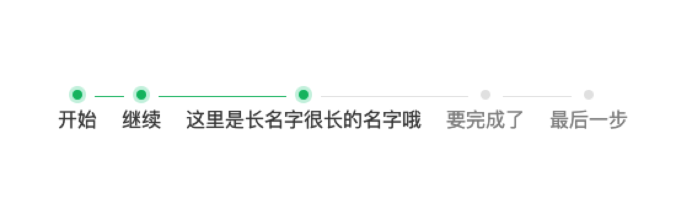
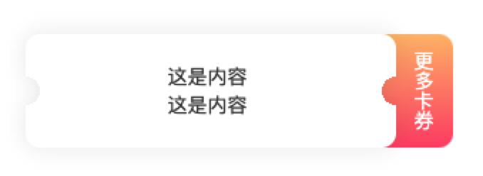
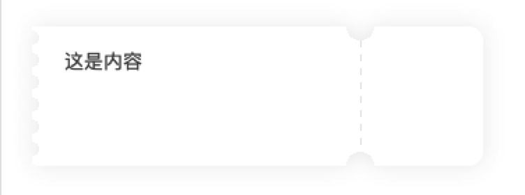

# 一些样式

## 步骤条



```html
<div class="step">
  <div class="item">
    <div class="dot"></div>
    <div>开始</div>
  </div>
  <div class="item">
    <div class="dot"></div>
    <div>继续</div>
  </div>
  <div class="item actived">
    <div class="dot"></div>
    <div>这里是长名字很长的名字哦</div>
  </div>
  <div class="item">
    <div class="dot"></div>
    <div>要完成了</div>
  </div>
  <div class="item">
    <div class="dot"></div>
    <div>最后一步</div>
  </div>
</div>
```

```scss
$green: rgb(0, 188, 112);
$green-light: rgba(0, 188, 112, .2);
$gray: #e6e6e6;
$dot-size: 8px;
$space: 10px;

.step {
  display: flex;
  margin: 100px;
  .item {
    position: relative;
    padding: 0 10px;
    color: #464646;

    .dot {
      display: block;
      margin: 0 auto 5px;
      width: $dot-size;
      height: $dot-size;
      border-radius: 50%;
      background: $green;
      box-shadow: 0 0 0 3px $green-light;
    }

    &::before,
    &::after {
      content: '';
      display: block;
      position: absolute;
      top: $dot-size / 2 + 1px;
      width: calc(50% - #{$space} - #{$dot-size / 2});
      height: 1px;
      background: $green;
    }
    &::before {
      left: 0;
    }
    &::after {
      right: 0;
    }
    &:first-child::before,
    &:last-child::after {
      display: none;
    }
    &.actived::after {
      background: $gray;
    }

    &.actived ~ .item {
      color: #909090;
      .dot {
        background: $gray;
        box-shadow: 0 0 0 3px transparent;
      }
      &::before,
      &::after {
        background: $gray;
      }
    }
  }
}
```

## 卡片



```html
<div class="card">
  <div class="content">
    <div>这是内容</div>
    <div>这是内容</div>
  </div>
  <div class="more">更多卡券</div>
</div>
```

```less
.card {
  position: relative;

  .content {
    @r: 10px;

    position: relative;
    filter: drop-shadow(0 0 8px rgba(0, 0, 0, .08));
    width: calc(100% - 40px);
    text-indent: 100px;
    padding: 20px 0;
    border-radius: 10px;
    background:
      radial-gradient(circle at 0 50%, transparent @r, #fff 0) left / 50% 100% no-repeat,
      radial-gradient(circle at 100% 50%, transparent @r, #fff 0) right / 50% 100% no-repeat;
  }

  .more {
    position: absolute;
    right: 0;
    top: 0;
    z-index: -1;
    width: 50px;
    height: 100%;
    line-height: 60px;
    color: #fff;
    text-align: center;
    writing-mode: vertical-lr;
    background: linear-gradient(180deg, #FFBF77 0%, #FF5574 100%);
    border-radius: 0 10px 10px 0;
  }
}
```



```html
<div class="voucher-item">
  <div style="height: 70px;">这是内容</div>
</div>
```

```less
.voucher-item {
  @rWidth: 88px;
  @r: 10px;

  position: relative;
  padding: 15px;
  width: 100%;
  border-radius: 0 10px 10px 0;
  background:
    radial-gradient(circle at right top, transparent @r, #fff 0) top left / calc(100% - @rWidth) 50% no-repeat,
    radial-gradient(circle at right bottom, transparent @r, #fff 0) bottom left / calc(100% - @rWidth) 50% no-repeat,
    radial-gradient(circle at left top, transparent @r, #fff 0) top right / @rWidth 50% no-repeat,
    radial-gradient(circle at left bottom, transparent @r, #fff 0) bottom right / @rWidth 50% no-repeat;
  filter: drop-shadow(0 0 8px rgba(0, 0, 0, .08));

  &::after {

    // 开启硬件加速，解决在iphone中展示性能不足问题
    transform: translateZ(0);

    @color: rgba(0, 0, 0, .1);
    content: '';
    position: absolute;
    left: calc(100% - @rWidth);
    top: @r;
    width: 1px;
    height: calc(100% - @r * 2);
    background: linear-gradient(to bottom, @color 0%, @color 50%, transparent 50%);
    background-size: 1px 10px;
  }

  &::before {
    @r: 5px;

    content: '';
    display: block;
    width: 16px;
    height: 100%;
    background: radial-gradient(circle at left, transparent @r, #fff 0) ;
    background-size: $width $width;
    position: absolute;
    top: 0;
    left: -$width / 2;
  }
}
```

## 单行超出省略 
```css
.ellisis {
  white-space: nowrap;
  overflow: hidden;
  text-overflow: ellipsis;
}
```

## 多行超出省略
```less
.multi-ellipsis(@lines) {
  display: -webkit-box;
  overflow: hidden;
  -webkit-line-clamp: @lines;

  /* autoprefixer: ignore next */
  -webkit-box-orient: vertical;
}
```

## 高清屏 1px 线
```less
.onepx(
  @positions: top right bottom left,
  @border-color: gray,
  @border-radius: 0
) when not (@positions = none) {
  &::after {
    content: '';
    pointer-events: none;
    position: absolute;
    width: 100%;
    height: 100%;
    left: 0;
    top: 0;
    border-radius: @border-radius;
    border: 0 solid @border-color;

    each(@positions, {
      border-@{value}-width: 1PX;
    })

    @media (-webkit-min-device-pixel-ratio: 2), (min-resolution: 2dppx) {
      width: 200%;
      height: 200%;
      transform: scale(0.5);
      transform-origin: 0 0;
      border-radius: @border-radius * 2;
    }

    @media (-webkit-min-device-pixel-ratio: 3), (min-resolution: 3dppx) {
      width: 300%;
      height: 300%;
      transform: scale(0.3333);
      transform-origin: 0 0;
      border-radius: @border-radius * 3;
    }
  }
}
```

## 聊天对话框


```html
<div class="chat">
  <div class="left">hello</div>
  <div class="right">你好</div>
  <div class="left">我是张三</div>
  <div class="left">我是二班的，你呢</div>
  <div class="right">我是李四</div>
  <div class="right">我是五班的，你喜欢吃什么？</div>
  <div class="left">炸鸡</div>
  <div class="left">汉堡</div>
  <div class="left">油条</div>
  <div class="right">哈哈，我喜欢火锅</div>
  <div class="right">麻辣烫</div>
  <div class="right">还有串串</div>
  <div class="left">那我们今天中午出去吃小面吧[xiao]</div>
  <div class="left">我发现一家很好吃的小面</div>
  <div class="left">[image]</div>
  <div class="left">[image]</div>
  <div class="right">要的要的</div>
  <div class="right">我也好久没吃了</div>
  <div class="right">[emoji]</div>
  <div class="right">哈哈</div>
</div>
```

```less
.chat {
  @border-radius: 12px;

  .left,
  .right {
    padding: 19px 24px;
    background: #fff;
    box-shadow: 0 12px 32px 0 rgba(170 242 255 / 14%);
    width: fit-content;
  }

  .left {
    border-radius: 0 @border-radius @border-radius 0;

    &:has(+ .left) {
      margin-bottom: @border-radius !important;
    }

    // 连续标签最后一个
    &:not(:has(+ .left)) {
      border-radius: 0 @border-radius @border-radius !important;
    }

    // 连续标签第一个
    &:not(.left + .left) {
      border-radius: @border-radius @border-radius @border-radius 0;
    }
  }

  .right {
    color: #019c78;
    margin-left: auto;
    border-radius: @border-radius 0 0 @border-radius;
    background: linear-gradient(90deg, #dbfff8 3%, #fff 100%);

    &:has(+ .right) {
      margin-bottom: @border-radius !important;
    }

    &:not(:has(+ .right)) {
      border-radius: @border-radius 0 @border-radius @border-radius !important;
    }

    &:not(.right + .right) {
      border-radius: @border-radius @border-radius 0 @border-radius;
    }
  }
}
```
