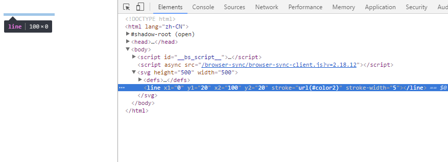
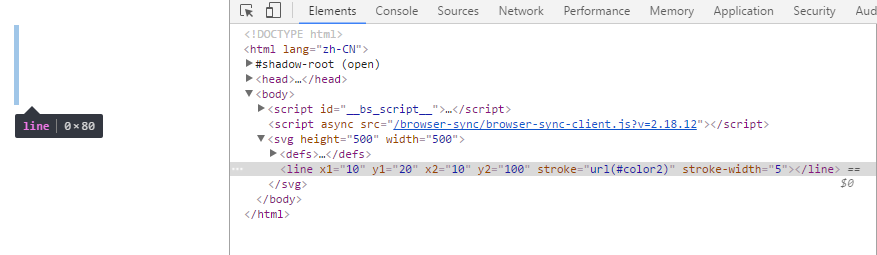
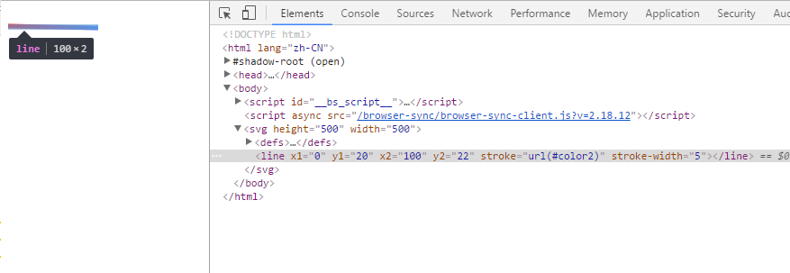
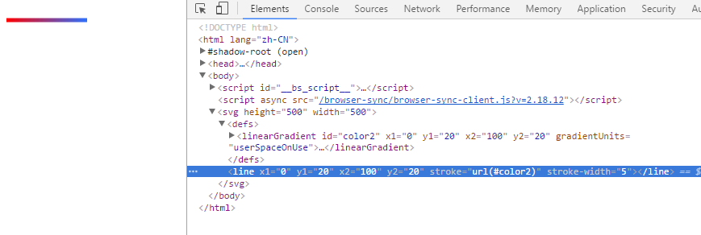

# svg画水平或垂直渐变线条

要在 svg 中画一条水平的渐变线条，代码如下：
一、水平渐变
```html
<svg height="500" width="500">
    <defs>
        <linearGradient id="color2" x1="0%" y1="0%" x2="100%" y2="0%">
            <stop offset="0%" style="stop-color: rgb(255, 0, 0);" />
            <stop offset="100%" style="stop-color: rgb(44, 113, 255);" />
        </linearGradient>
    </defs>
    <line x1="0" y1="20" x2="100" y2="20" stroke="url(#color2)" stroke-width="5" />
</svg>
```

没按我想象中的出现一条水平渐变的线条，只有一片空白


继续捣鼓

二、垂直渐变
```html
<svg height="500" width="500">
    <defs>
        <linearGradient id="color2" x1="0%" y1="0%" x2="100%" y2="0%">
            <stop offset="0%" style="stop-color: rgb(255, 0, 0);" />
            <stop offset="100%" style="stop-color: rgb(44, 113, 255);" />
        </linearGradient>
    </defs>
    <line x1="10" y1="20" x2="10" y2="100" stroke="url(#color2)" stroke-width="5" />
</svg>
```


三、不是水平或垂直的渐变
```html
<svg height="500" width="500">
    <defs>
        <linearGradient id="color2" x1="0%" y1="0%" x2="100%" y2="0%">
            <stop offset="0%" style="stop-color: rgb(255, 0, 0);" />
            <stop offset="100%" style="stop-color: rgb(44, 113, 255);" />
        </linearGradient>
    </defs>
    <line x1="0" y1="20" x2="100" y2="22" stroke="url(#color2)" stroke-width="5" />
</svg>
```


可以看出，在水平或垂直的情况下元素的宽度或高度为零，渐变未生效，其它情况下元素的宽度和高度均不是零，渐变生效

## 解决方案
在渐变中加上属性 gradientUnits="userSpaceOnUse"：
```html
<svg height="500" width="500">
    <defs>
        <linearGradient id="color2" x1="0" y1="20" x2="100" y2="20">
            <stop offset="0%" style="stop-color: rgb(255, 0, 0);" />
            <stop offset="100%" style="stop-color: rgb(44, 113, 255);" />
        </linearGradient>
    </defs>
    <line x1="0" y1="20" x2="100" y2="20" stroke="url(#color2)" stroke-width="5" />
</svg>
```


gradientUnits 定义了使用的坐标单位，可用属性如下：
 名称                          | 单位    | 使用坐标系     | 描述
 objectBoundingBox（默认值）    | 百分比  | 自身坐标系     | 基于渐变元素的长宽的百分比
 userSpaceOnUse                | 数值    | 原始坐标系     | 相对原始坐标系的数值（绝对值）

## 总结
在 svg 中 line 或 path 都存在上述问题，都可用上述方式解决

## 参考
- [http://www.cnblogs.com/anrainie/p/5996496.html](http://www.cnblogs.com/anrainie/p/5996496.html)
- [gradientUnits](https://developer.mozilla.org/en-US/docs/Web/SVG/Attribute/gradientUnits)