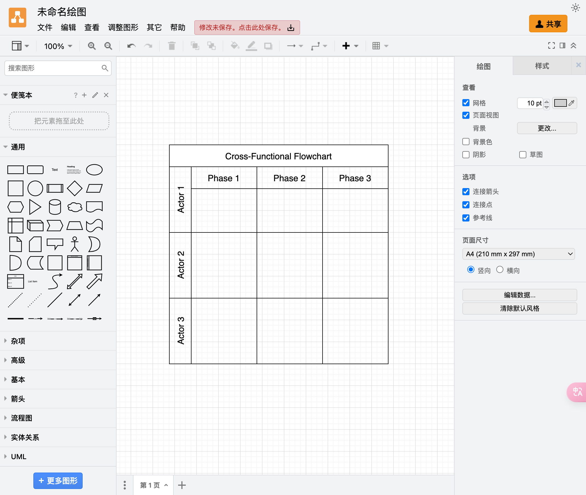

# 画图
- [draw.io](https://app.diagrams.net/)

# 截图
- [snipaste](https://zh.snipaste.com/)

# 数学运算库
- [math](https://mathjs.org/index.html)

# 浏览器中源代码定位
- [code-inspector-plugin](https://inspector.fe-dev.cn/guide/introduction.html)
code-inspector-plugin 是一款基于 webpack/vite/rspack/nextjs/nuxt/umijs plugin 的提升开发效率的工具，点击页面上的 DOM，它能够自动打开你的 IDE 并将光标定位到 DOM 对应的源代码位置

# 代码编辑器
- [monaco-editor](https://microsoft.github.io/monaco-editor/)
- [CodeMirror](https://codemirror.net/)

# 富文本编辑器
- [draftjs](https://draftjs.org/) Rich Text Editor Framework for React
- [Prosemirror](https://prosemirror.net/)

# 移动端跨平台开发
- [ReactNative](https://reactnative.dev/)
- [uniapp](https://uniapp.dcloud.net.cn/quickstart.html)

# 交互动画
- [GSAP](https://gsap.com/)
- [lottie](https://airbnb.io/lottie/#/)
- [matter](http://brm.io/matter-js/) 2D物理引擎
- [treejs](https://threejs.org/) 3D库

# CSS loading
https://css-loaders.com/

# npm 包管理器
- [FNM](https://github.com/Schniz/fnm) Fast and simple Node.js version manager, built in Rust

# icon
- [iconfont](https://www.iconfont.cn/)
- [iconify](https://iconify.design/)