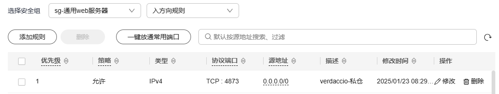
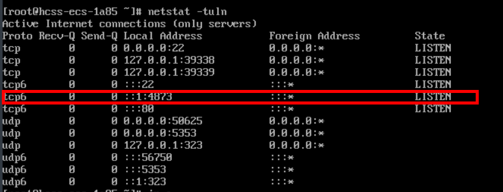
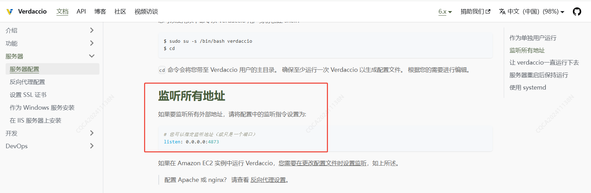
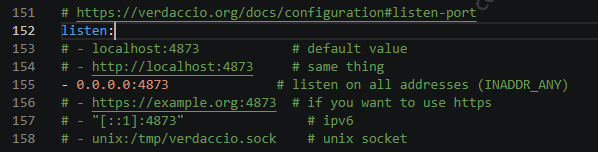

# 部署 verdaccio 服务后外网防问不通问题

背景：今天准备在华为云上部署 verdaccio 服务，以创建自己的私有 npm 仓库

## 操作步骤
1. 安装 Node.js：确保服务器上安装了Node.js环境，因为Verdaccio是基于Node.js的应用
2. 安装 Verdaccio：全局安装 Verdaccio
```bash
npm i -g verdaccio
```
3. 通过 PM2 运行 Verdaccio
```bash
npm i -g pm2
pm2 start verdaccio --name verdaccio
```
4. 配置访问
访问 `http://localhost:4873` 来查看 Verdaccio 的管理界面。在这里，可以配置用户权限、包管理等选项
这一步需要通过外网防问，也即： `http://[ip]:4873`，发现访问被禁

5. 配置安全组规则，增加放行 4873


6. 按官网 ECS 端口不通[文档](https://support.huaweicloud.com/trouble-ecs/zh-cn_topic_0191526704.html)排查：
- 没开防火墙
- 端口也在监听着的 `netstat -tuln`

但 4873在 IPV6 的回环地址监听，所以外网防问不了

::1 是 IPv6 的回环地址，相当于 IPv4 中的 127.0.0.1。它表示本地计算机， ::1 作为监听地址时，服务只会监听来自本地主机的 IPv6 请求

:: 是一个特殊的 IPv6 地址，表示“所有可用的接口”或“所有地址”当你在服务中使用 :: 作为监听地址时，服务将会在所有可用的网络接口上监听 IPv6 请求

80端口能访问是因为监听的所有地址，4873端口仅监听本地连接，限制访问仅限于本机

所以如果我还是用 IPV6 的话，只要最终出来的地址是 :::4873 ，理论上外网也能访问通

7. 查看官方文档的 [服务器配置](https://verdaccio.org/zh-CN/docs/server-configuration#keeping-verdaccio-running-forever)



8. 找到 verdaccio 的配置文件，默认在 `~/.config/verdaccio/config.yaml`，按官方文档修改配置文件，重启服务即可

