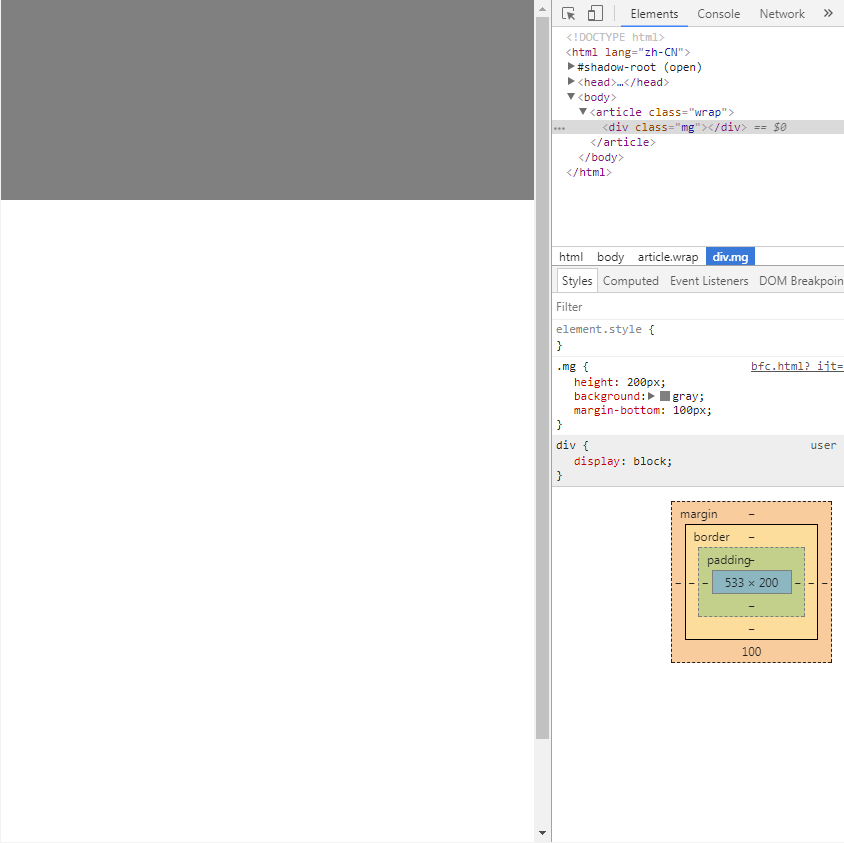

# min-height与margin出现滚动条

今天遇到一个比较怪的问题，demo 代码如下：
```html
<!DOCTYPE html>
<html lang="zh-CN">
<head>
    <meta charset="UTF-8">
    <title>Title</title>
    <style>
        body {
            margin: 0;
        }
        .mg {
            height: 200px;
            background: gray;
            margin-bottom: 100px;
        }
        .wrap {
            min-height: 100vh;
        }
    </style>
</head>
<body>
<article class="wrap">
    <div class="mg"></div>
</article>
</body>
</html>
```
按理说 div 盒子的高度没超过屏幕的高度不会出现滚动条，但实际情况却出现了：


不明白，留待日后补充

## 2023.02.28补充

经最新浏览器测试（chrome 110.0.5481.100），该问题已经不存在了，猜测是浏览器历史bug
