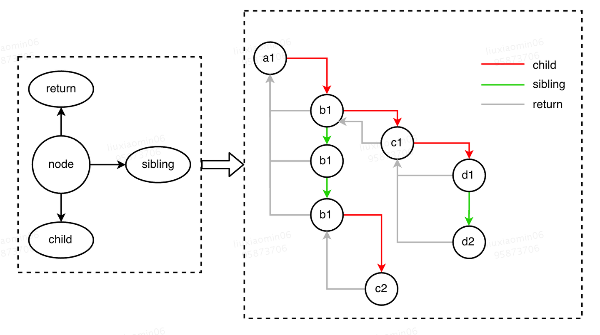

# React Fiber

## 要解决的问题？
为了解决复杂组件 diff 递归无法中断导致的性能问题，在 Fiber 诞生之前，React 处理一次 setState()（首次渲染）时会有两个阶段：

1. 调和阶段（Reconciler）：这个阶段React用新数据生成新的 Virtual DOM，遍历 Virtual DOM，然后通过 Diff 算法，快速找出需要更新的元素，放到更新队列中去。
2. 渲染阶段（Renderer）：这个阶段 React 根据所在的渲染环境，遍历更新队列，将对应元素更新。在浏览器中，就是更新对应的 DOM 元素

这种策略会深度优先遍历所有的 Virtual DOM 节点，进行 Diff 。它一定要等整棵 Virtual DOM 计算完成之后，才将任务出栈释放主线程。对于复杂组件，需要大量的 diff 计算，会严重影响到页面的交互性。

React15架构可以分为两层：
Reconciler（协调器）—— 负责找出变化的组件；
Renderer（渲染器）—— 负责将变化的组件渲染到页面上；

React16架构可以分为三层：
Scheduler（调度器）—— 调度任务的优先级，高优任务优先进入Reconciler；主要功能是时间分片，每隔一段时间就把主线程还给浏览器，避免长时间占用主线程
Reconciler（协调器）—— 负责找出变化的组件：更新工作从递归变成了可以中断的循环过程。Reconciler内部采用了Fiber的架构；
Renderer（渲染器）—— 负责将变化的组件渲染到页面上。

## Fiber 主要结构
```js
{
  ...
  // 跟当前Fiber相关本地状态（比如浏览器环境就是DOM节点）
  stateNode: any,
    
  // 单链表树结构
  return: Fiber | null,// 指向他在Fiber节点树中的`parent`，用来在处理完这个节点之后向上返回
  child: Fiber | null,// 指向自己的第一个子节点
  sibling: Fiber | null,  // 指向自己的兄弟结构，兄弟节点的return指向同一个父节点

  // 更新相关
  pendingProps: any,  // 新的变动带来的新的props
  memoizedProps: any,  // 上一次渲染完成之后的props
  updateQueue: UpdateQueue<any> | null,  // 该Fiber对应的组件产生的Update会存放在这个队列里面
  memoizedState: any, // 上一次渲染的时候的state, hooks链表
    
  // Scheduler 相关 old
  // expirationTime: ExpirationTime,  // 代表任务在未来的哪个时间点应该被完成，不包括他的子树产生的任务
  // // 快速确定子树中是否有不在等待的变化
  // childExpirationTime: ExpirationTime,

  // Scheduler 相关 new
  lanes: Lanes,
  childLanes: Lanes,
    
 // 在Fiber树更新的过程中，每个Fiber都会有一个跟其对应的Fiber
  // 我们称他为`current <==> workInProgress`
  // 在渲染完成之后他们会交换位置
  alternate: Fiber | null,

  // Effect 相关的
  effectTag: SideEffectTag, // 用来记录Side Effect
  nextEffect: Fiber | null, // 单链表用来快速查找下一个side effect
  firstEffect: Fiber | null,  // 子树中第一个side effect
  lastEffect: Fiber | null, // 子树中最后一个side effect
  ....
};
```

重点关注属性：
- return(父节点)：向上链接整颗树
- child(子节点)：向下链接整棵树
- sibling(兄弟节点)：横向链接整颗树
- stateNode（对应的 DOM 节点）：与 DOM 树相连
<!-- - expirationTime (到期时间)：计算节点更新的优先级 old -->
- lanes（优先级）：31 位二进制数据，计算节点更新的优先级
- Effect (变更)：记录节点的变更

## 过程
React 在 render 第一次渲染时会生成Virtual DOM Tree. 同时也会基于 Virtual DOM Tree 构建一个类似结构 Fiber Tree


## 主要特点

- (任务)动态优先级
react之前的版本用 `expirationTime` 属性代表优先级，该优先级和IO不能很好的搭配工作（io的优先级高于cpu的优先级），现在有了更加细粒度的优先级表示方法 `Lane`，`Lane` 用31位的二进制来表示，越小优先级越高。

如何处理任务饥饿问题（是指当执行一个任务时，不断的插入多个比该任务优先级高的任务，那么这个任务会一直得不到执行）：
为当前任务根据优先级添加过期时间，并检查未执行的任务中是否有任务过期，有任务过期则在`expiredLanes`中添加该任务的`lane`，在后续该任务的执行中以同步模式执行

- 可中断的渲染
当React在执行任务时，如果发现某个任务的执行时间超过了当前帧的剩余时间，它就会暂停执行，让出控制权给浏览器，并在下一帧继续执行。
出控制权通常可以通过使用浏览器的 `requestIdleCallback` 函数实现（`react`通过`MessageChannel`实现）
```ts
function enqueueTask(task: () => void): void {
  const channel = new MessageChannel();
  channel.port1.onmessage = () => {
    channel.port1.close();
    task();
  };
  channel.port2.postMessage(undefined);
}
```

[React Scheduler 为什么使用 MessageChannel 实现](./芝麻.md)
