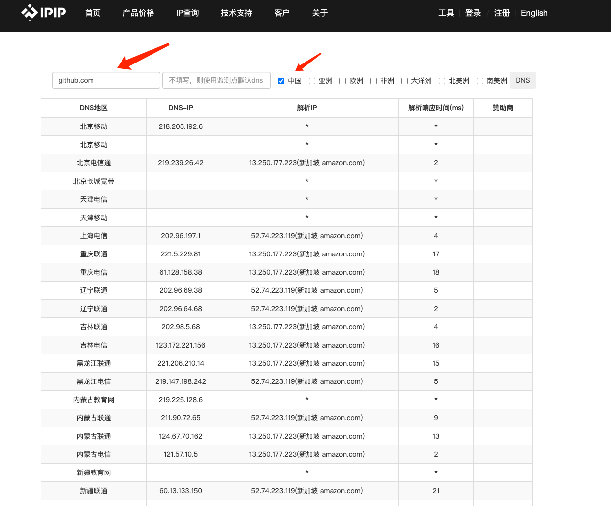

# Github连接超时问题

最近公司网络连不上 github 了，`ping github.com` 超时，`ping baidu.com`正常，
通过手机4G也能访问 github，说明网络是通的，应该是 DNS 解析有问题，下面把解决方案记录，以方便来人。

整体解决思路是找到能访问 github 的IP，然后修改本地 hosts 文件，添加或修改 github 域名对应的解析 IP。具体过程如下：

1、找到 github.com 域名的解析IP，本人是在[IPIP](https://tools.ipip.net/dns.php)上查询的


可以发现有很多解析IP，我这里选取了解析响应时间较快的北京电信通 `13.250.177.223`

2、修改 hosts 文件，添加如下代码至 hosts 文件中，对于 hosts 修改有问题的请自行百度。
```
13.250.177.223 github.com
```
