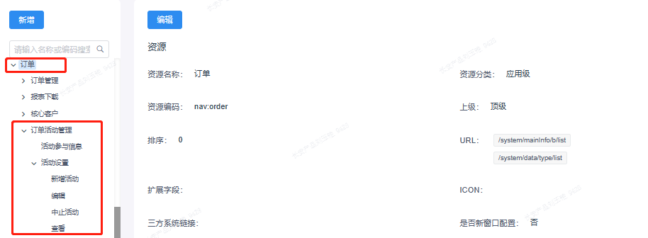

# 权限设计

## 什么是基于角色的访问控制 (RBAC)？
基于角色的访问控制 (RBAC：Role-Based Access Control) 是一种根据用户的预定义角色，授权最终用户访问系统、应用程序和数据的模型。
在 RBAC 系统中，管理员为每个用户分配一个或多个角色。每个新角色都代表了用户的一组权限或特权。
财务角色可能授权用户进行采购、运行 forecasting 软件或授予供应链系统访问权限。人力资源角色可能授权用户查看人事档案并管理员工福利系统。
关系：
用户 - 角色 - 资源项
从左往右都是一对多关系

## 整体设计：
深蓝营销系统权限模型采用RBAC认证鉴权模型。
每一种角色对应一组相应的资源项，每个资源项代表页面、菜单或者按钮，每个资源项由资源编码、资源分类、上级等属性构成。
一旦用户被分配了适当的角色后，该用户就拥有此角色的所有资源项。
前端通过用户拥有的资源项列表渲染用户页面，业务网关通过资源项完成功能的鉴权。
不必在每次创建用户时都进行分配权限的操作，只要分配用户相应的角色即可，而且角色的权限变更比用户的权限变更要少得多，减少系统的开销和频繁设置。

### 资源项组成

- 资源名称
- 资源编码
应用级：`nav:{navName}`；
菜单级：`menu:{navName}:{menuName}`；
操作级：`opt:{navName}:{menuName}:optName`；

示例：以【订单】为最上级拓展一棵资源树

| 资源名称 | 资源分类 | 资源编码 |
| --- | --- | --- |
| 订单 | 应用级 | nav:order |
| 订单活动管理 | 菜单级（一级）| menu:order:orderActivity |
| 活动设置 | 菜单级（二级）| menu:order:orderActivity:activity |
| 新增活动 | 操作级 | opt:order:orderActivity:activity:add |
| 编辑 | 操作级 | opt:order:orderActivity:activity:edit |

- 资源分类
- 上级资源
- 资源描述
- 状态 启用/停用
启用状态下，角色关联才能查询到此资源

- 关联角色

- URL
用户配置该资源项关联的接口
接口用英文逗号 `,` 分隔
路径传参参数用 `${}` 替换

## 权限设计规范
- 明确定义前端控制资源项，资源项名称与产品设计页面对应菜单、操作按钮名称保持一致，做到每个资源是可配置且可控制，且能支持业务复杂配置场景——不可只是纯粹增加资源项而不做代码层控制
- 若页面级含有操作项，需做到操作项的按钮控制，便于后续交叉场景的配置
- 不可过度设置资源项，如一个页面的查询、重置等系统基础操作组件，不用做控制
- 设置资源项的颗粒度以保证此功能业务场景的配置复杂度为标准
- 明确定义每个角色可赋予的资源项列表（统一表格记录）

