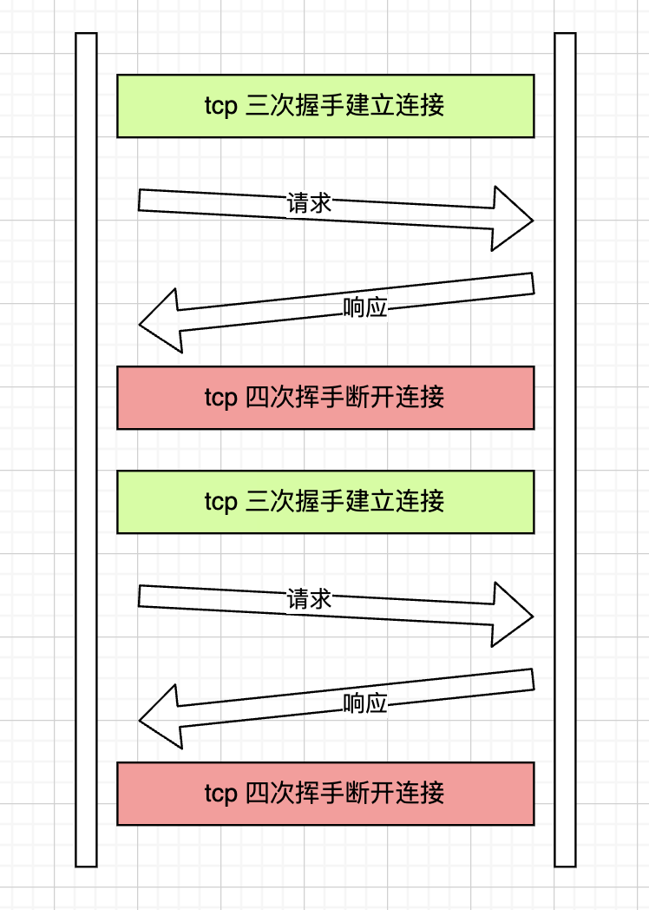
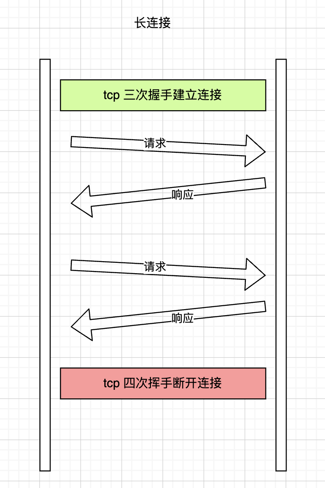
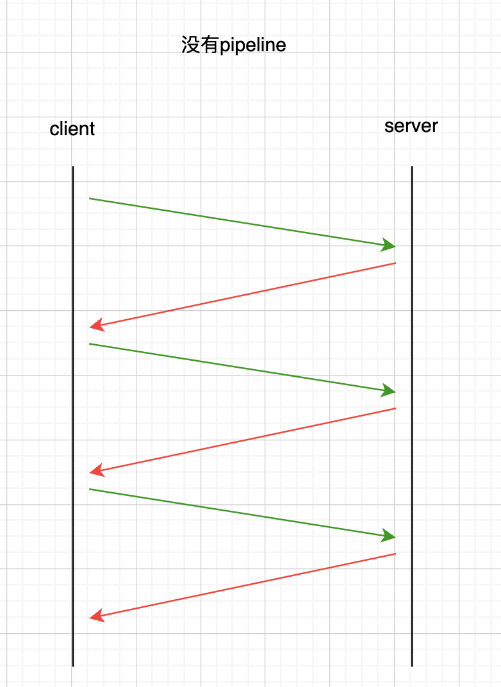
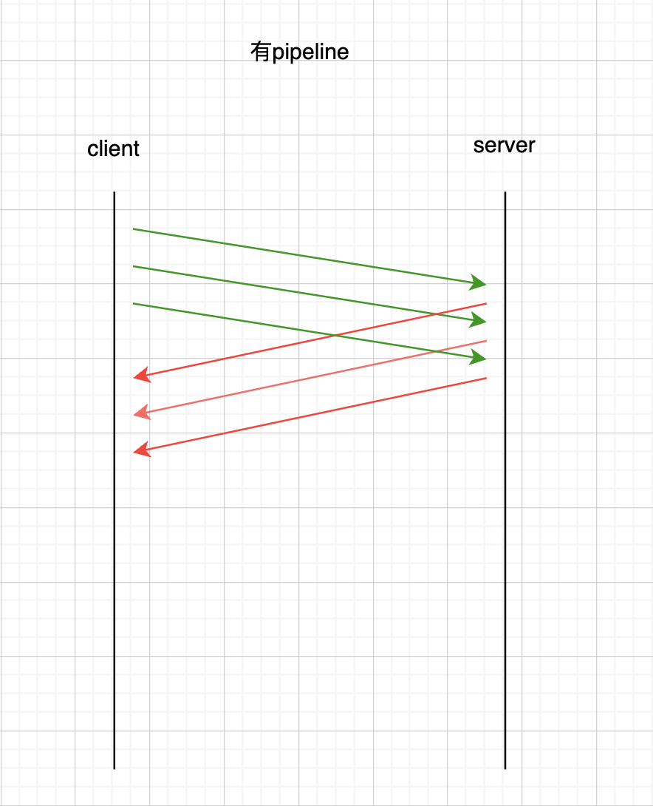

# 请求连接与传输

##  长连接

http1.0的请求是如何建立连接的呢？
首先我们要清楚的是，http不论哪个版本，都是建立在tcp协议上的，而tcp的连接需要经历三次握手，tcp的关闭需要四次挥手，而http1.0协议中每个http请求都需要经历三次握手和四次挥手，页面中都多少个http请求，就需要建立多少次握手和挥手，流程如图：



http长连接，其实质就是 tcp 长连接，如果页面发起多个http请求，此时只需要建立一个tcp连接就可以了，多个http请求响应回共用这一个tcp连接通道。

此时http请求中会携带一个Http请求头：`Connection: keep-alive`,现在大部分的web服务器都默认支持tcp长连接，也就是网页中的请求不携带`Connection：keep-alive`请求头，默认就是长连接请求，如果不想支持长连接的话，需要显示的添加`Connection: close`请求头。



服务端如果启用长连接，一般会在响应头带上如下内容：
```bash
Connection: Keep-Alive
Keep-Alive: timeout=1800, max=5
```

## 管道化

在一般情况下，HTTP遵守“请求-响应”的模式，也就是客户端每次发送一个请求到服务端，服务端返回响应，如果页面中有多个请求，每个请求必须等到前一个请求响应之后才能发送。



为了提高速度和效率，在长连接的基础上，HTTP1.1进一步地支持在持久连接上使用管道化（pipelining）特性。管道化允许客户端在已发送的请求收到服务端的响应之前发送下一个请求，借此来减少等待时间。



同一个tcp连接中可以同时发送多个http请求，也就是并发，但在响应的时候，必须排队响应，谁先到达谁先响应，假如其中某个响应延迟了几秒，后面的响应还是会被阻塞，这就是队头阻塞，出现队头阻塞的原因有两个：

独立的消息数据都在一个链路上传输，也就是有一个“队列”。比如TCP只有一个流，多个HTTP请求共用一个TCP连接
队列上传输的数据有严格的顺序约束。比如TCP要求数据严格按照序号顺序，HTTP管道化要求响应严格按照请求顺序返回

### 管道化的限制：
1. 管道化要求服务端按照请求发送的顺序返回响应，原因很简单，HTTP请求和响应并没有序号标识，无法将乱序的响应与请求关联起来。
2. 客户端需要保持未收到响应的请求，当连接意外中断时，需要重新发送这部分请求。
3. 只有幂等的请求（不会对服务器资源产生影响的请求）才能进行管道化，也就是只有GET和HEAD请求才能管道化，否则可能会出现意料之外的结果

因为管道化本身可能会导致队头阻塞以及一些其他原因，现代浏览器默认关闭了管道化。

## 如何解决队头阻塞

1. 如何解决HTTP队头阻塞
- 为了缓解这个问题，浏览器会对同一个域名建立多个 TCP 连接，来实现 HTTP 的并发，同一域名下 TCP 连接数最多在 6-8 个，以减少队服务器的压力。
如果网页一次性要加载的资源太多，比如大量图片，可以使用域名分片（Domain sharding）的方法，将资源放到不同的域名下，以突破连接数限制。
- 对于HTTP1.1中管道化导致的请求/响应级别的队头阻塞，可以使用HTTP2解决。HTTP2不使用管道化的方式，而是引入了帧、消息和数据流等概念，每个请求/响应被称为消息，每个消息都被拆分成若干个帧进行传输，每个帧都分配一个序号。每个帧在传输是属于一个数据流，而一个连接上可以存在多个流，各个帧在流和连接上独立传输，到达之后在组装成消息，这样就避免了请求/响应阻塞。

当然，即使使用HTTP2，如果HTTP2底层使用的是TCP协议，仍可能出现TCP队头阻塞。

1. 如何解决TCP队头阻塞
TCP中的队头阻塞的产生是由TCP自身的实现机制决定的，无法避免。想要在应用程序当中避免TCP队头阻塞带来的影响，只有舍弃TCP协议。
比如：HTTP3在某种程度上可以说避免了 TCP 中的队头阻塞，因为它根本不使用 TCP 协议，而是在UDP协议的基础上实现了可靠传输。而UDP是面向数据报的协议，数据报之间不会有阻塞约束。

1. 此外还有一个SCTP（Stream Control Transmission Protocol 流控制传输协议），它是和TCP、UDP在同一层次的传输协议。SCTP的多流特性也可以尽可能的避免队头阻塞的情况。

## 参考：
[什么是队头阻塞以及如何解决](https://juejin.cn/post/6844903853985366023)