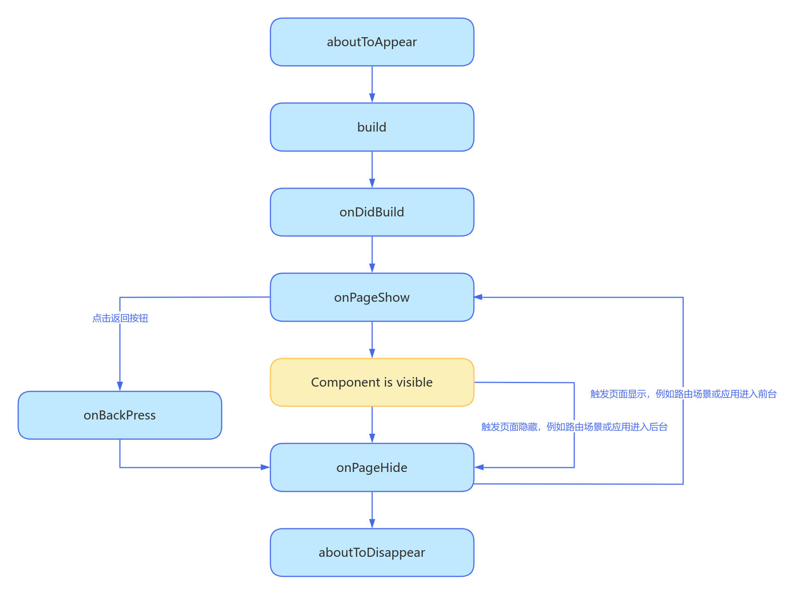

# 页面和自定义组件生命周期

## 概念
自定义组件：由 `@Component`装饰的UI单元，可以组合多个系统组件实现UI的复用，可以调用组件的生命周期。

页面：即应用的UI页面。可以由一个或者多个自定义组件组成，`@Entry`装饰的自定义组件为页面的入口组件，即页面的根节点，一个页面有且仅能有一个`@Entry`。只有被`@Entry`装饰的组件才可以调用页面的生命周期，页面里也可以同时包含自定义组件生命周期。

## 页面生命周期：
- `onPageShow`：页面每次显示时触发一次，包括路由过程、应用进入前台等场景
- `onPageHide`：页面每次隐藏时触发一次，包括路由过程、应用进入后台等场景。
- `onBackPress`：当用户点击返回按钮时触发

## 组件生命周期：
- `aboutToAppear`：组件即将出现时回调该接口，具体时机为在创建自定义组件的新实例后，在执行其build()函数之前执行。

- `onDidBuild`：组件build()函数执行完成之后回调该接口，不建议在onDidBuild函数中更改状态变量、使用animateTo等功能，这可能会导致不稳定的UI表现。

- `aboutToDisappear`：aboutToDisappear函数在自定义组件析构销毁之前执行。不允许在aboutToDisappear函数中改变状态变量，特别是@Link变量的修改可能会导致应用程序行为不稳定。

## 各场景生命周期示例
前提：若一个页面 A 中包含子自定义组件 B，除非单独指明，下面的场景均在说 AB 相关的生命周期触发顺序

### 创建至显示
1. 页面 A 的 `aboutToAppear`,`onDidBuild`
2. 组件 B 的 `aboutToAppear`,`onDidBuild`
3. 页面 A 的 `onPageShow`
组件相关的生命周期完了才触发页面相关的生命周期

### 页面 A 通过 push 方式跳转到其它页面 C
1. 页面 C 的 `aboutToAppear`,`onDidBuild`
2. 页面 A 的 `onPageHide`
3. 页面 C 的 `onPageShow`
A B 没有销毁只是隐藏了，不会触发 A B 组件相关的生命周期

### 从其它页面 C 点击返回至跳转至页面 A
1. 页面 C 的 `onBackPress`,`onPageHide`
2. 页面 A 的 `onPageShow`
3. 页面 C 的 `aboutToDisappear`
返回会导致路由出栈，栈顶页面 C 销毁

### 页面 A 通过 replace 方式跳转到其它页面 C
1. 页面 C 的 `aboutToAppear`,`onDidBuild`
2. 页面 A 的 `onPageHide`
3. 页面 C 的 `onPageShow`
4. 页面 A 的 `aboutToDisappear`
5. 组件 B 的 `aboutToDisappear`
replace会销毁当前页面，继而触发页面和组件相关的生命周期，
组件的销毁是从组件树上直接摘下子树，所以先调用父组件的aboutToDisappear，再调用子组件的aboutToDisappear.

### 页面 A 最小化或进入后台，然后再回到前台
1. 页面 A 的 `onPageHide`
2. 页面 A 的 `onPageShow`
A B 没有销毁只是隐藏了，不会触发 A B 组件相关的生命周期

### 退出应用
1. 页面 A 的 `onPageHide`
2. 页面 A 的 `aboutToDisappear`
3. 组件 B 的 `aboutToDisappear`

生命周期流程如下图所示，下图展示的是被@Entry装饰的组件（页面）生命周期

