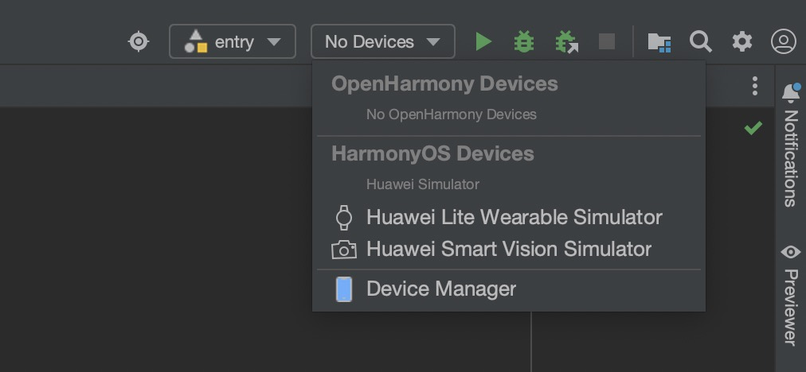
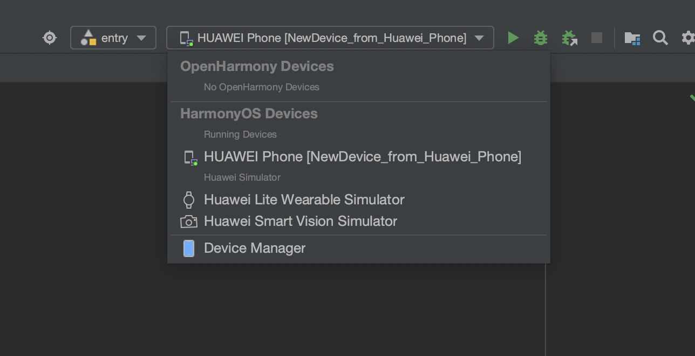

# 鸿蒙踩坑记录

## 启动模拟器后在 Devices 找不到启动的模拟器
- 时间：2024/03/15

- 环境：DevEco Studio 3.1.1 Release

- 操作过程：
直接按官方文档配置好开发环境后，运行Hello Wrold程序，在创建并启动好模拟器后，Devices下拉列表里找不到新启动的模拟器

- 原因：IDE bug，等官方修复

- 解决方案：
启动模拟器，彻底退出 DevEco Studio，模拟器不退出，重启 DevEco Studio就可以了

